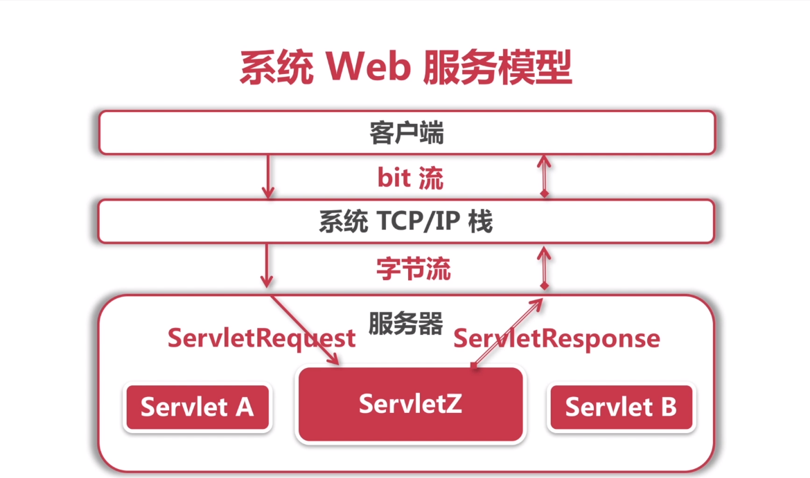

># 手写SpringMVC
>> * [模块结构](#模块结构)
>> * [Spring包结构](#Spring包结构)
>> * [结构设计](#结构设计)
>>      * [实现Core模块，包括core、beans、context包](#实现Core模块，包括core、beans、context包)
>>      * [实现Web，集成web和webmvc](#实现Web，集成web和webmvc)
>>      * [添加statrer，实现类spring-boot的启动方式](#添加statrer，实现类spring-boot的启动方式)
>> * [服务器和Servlet](#服务器和Servlet)
>>      * [Web服务器](#Web服务器)
>> * [系统Web服务模型](#系统Web服务模型)
>>      * [请求分发流程](#请求分发流程)
>>      * [Servlet](#Servlet)
>> * [Tomcat](#Tomcat)
>> * [Servlet的维护](#Servlet的维护)
>> * [原Servlet调度流程](#原Servlet调度流程)
>> * [服务器调度问题](#服务器调度问题)
>> * [Spring调度流程](#Spring调度流程)
>> * [Spring调度优势](#Spring调度优势)
>> * [类加载器](#类加载器)
>> * [Java类文件规范](#Java类文件规范)
>> * [反射](#反射)
>> * [bean](#bean)
>> * [bean优势](#bean优势)
>> * [普通类创建方式](#普通类创建方式)
>> * [Spring实现方式](#Spring实现方式)
>> * [控制反转/依赖注入](#控制反转/依赖注入)
>> * [普通控制方式](#普通控制方式)
>> * [控制反转方式](#控制反转方式)
>> * [bean创建方式](#bean创建方式)
>> * [实现依赖注入](#实现依赖注入)
>> * [依赖注入次序问题](#依赖注入次序问题)

># 模块结构
   
># Spring包结构
   
   

># 结构设计
>>## ***`实现Core模块，包括core、beans、context包`**
>>## ***`实现Web，集成web和webmvc`**
>>## ***`添加statrer，实现类spring-boot的启动方式`**   

># 服务器和Servlet
>>## Web服务器
>>>### ****`监听一个TCP端口`***
>>>### ****`转发请求，回收响应`***
>>>### ****`本身没有业务逻辑，连接操作系统和应用程序代码`***

># 系统Web服务模型
   
>>## ***`请求分发流程`**
   
>>## ***`Servlet`**
>>>### ****`一种规范：约束了Java服务器与业务类的通信方式`***
>>>### ****`一个接口：javax.servlet.Servlet`***
>>>### ****`一种Java类：实现了Servlet接口的应用程序类`***

># Tomcat
>>## ***`Java原生，运行在JVM上`**
>>## ***`多种并发模型，高性能`**
>>## ***`支持嵌入式应用程序`**

># Servlet的维护
>>## ***`由服务器调度配置`**
>>## ***`使用web.xml中性化配置`**
>>## ***`每种业务添加一个Servlet，对应一个URI`**

># 原Servlet调度流程
   
   
># 服务器调度问题
>>## ***`配置集中，大而杂，不易管理`**
>>## ***`多次实现Servlet接口，不必要`**

># Spring调度流程
   
   
># Spring调度优势
>>## ***`用注解，实现简单，按需实现`**
>>## ***`配置分散，不杂乱`**
>>## ***`容器内实现，易控制`**

># 类加载器
>>## ***`通过类全限定名获取类的二进制`**
>>## ***`解析二进制字节流，获取Class实例`**
>>## ***`加载classpath下的静态资源`**

># Java类文件规范
>>## ***`统一的Resource抽象`**
>>## ***`每个Java类文件和类名对应`**
>>## ***`包名和文件夹路径对应`**

># 反射
>>## ***`活跃于运行时(Runtime)`**
>>## ***`获取属性和方法实例`**
>>## ***`动态实例化类`**

># bean
>>## ***`生命周期较长`**
>>## ***`在整个虚拟机内可见`**
>>## ***`维护成本高，单例存在`**

># bean优势
>>## ***`运行期效率高`**
>>## ***`统一维护，便于管理和扩展`**
>>## ***`维护成本高，单例存在`**

># 普通类创建方式
   
   
># Spring实现方式
>>## ***`包扫描自动装配(反射)`**
>>## ***`BeanFactory(统一管理)`**
>>## ***`依赖注入`**

># 控制反转/依赖注入
>>## ***`IOC(Inversion Of Controller):思想`**
>>## ***`DI(Dependency Injection):方式`**
>>## ***`依赖注入`**

># 普通控制方式
   

># 控制反转方式
   

># bean创建方式
   

># 实现依赖注入
>>## ***`扫描包获得类定义(已达成)`**
>>## ***`初始化Bean,并实现依赖注入`**
>>## ***`解决Bean初始化顺序问题`**

># 依赖注入次序问题
   